<!-- 💾 Matrix Rain SVG -->

  

<!-- 🌐 Neon Divider -->

  

<!-- 🧱 EXPERIENCE BLOCK with glass effect -->

  

    4+ years of experience ensuring quality across <b>backend</b>, <b>web</b>, and <b>mobile</b> layers. 
    Worked on <b>FinTech</b>, <b>AI-driven Compliance</b>, <b>Telemedicine</b>, and <b>high-load B2C platforms</b> — 
    where correctness, data integrity, and user experience directly impact business results.
  

  

